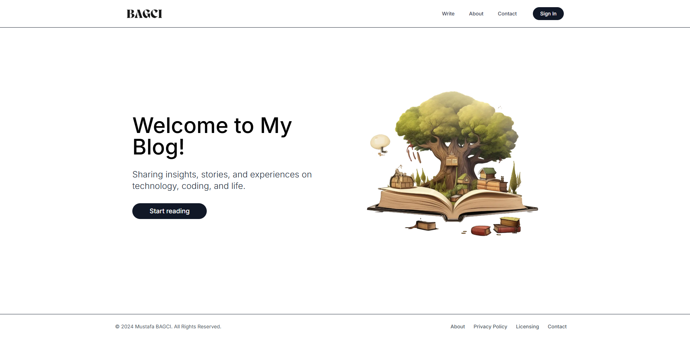

# Blog Platform



This is a blog platform built using Next.js.

## Getting Started

To get started, clone the repository and install the dependencies:

```bash
git clone https://github.com/mustafa-bagci/blog-website-nextjs.git
cd blog-website-nextjs
npm install
```

## Running the Development Server

To start the development server, run:

```bash
npm run dev
```

Open [http://localhost:3000](http://localhost:3000) with your browser to see the result.

## Building for Production

To build the application for production, run:

```bash
npm run build
```

## Deploying

You can deploy the application to Vercel, Netlify, or any other hosting provider that supports Next.js.
